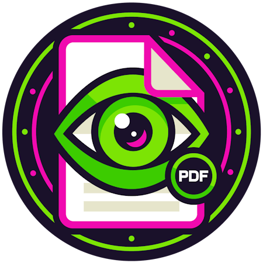

<div align="center">

<h1>Mud PDF</h1>

<div></div>

<div><a href="https://mudpdf.info">Demo</a> | <a href="https://mudpdf.info/docs/quickstart">Quickstart</a> | <a href="https://mudpdf.info/docs">Documentation</a></div>

Originally a port of the BlazorBootstrap PDF viewer, Mud PDF is a simple yet powerful PDF solution for MudBlazor.


</div>

## Installation

Grab the package from [nuget.org](https://www.nuget.org/packages/Gotho.MudBlazor.PdfViewer/1.0.1#readme-body-tab);

```
dotnet add package Gotho.MudBlazor.PdfViewer --version 2.0.0
```

### Configure

Add the following to your application startup in `Program.cs`;

```
builder.Services.AddMudBlazorPdfViewer();
```

Update your `App.razor` file to import the required CSS;

```
<link href="_content/Gotho.MudBlazor.PdfViewer/mudpdf.min.css" rel="stylesheet"/>
```

Then, add the namespace to your `_Imports.razor` file;

```
@using MudBlazor.PdfViewer
```

You should now be fully setup to use the `MudPdfViewer` component in your code!


## Prerequisites

In order to use this package, your project will need to be configured with the following;

- **MudBlazor** Version 8.0.0 or later
- **.NET** Version 8.0 or 9.0

## Usage & Examples

Please see the [documentation site](https://mudpdf.info/docs) for detailed examples

## Contributing

Feel free to make contributions.

## License

> ℹ️ Important
>
> Please read the following carefully as it may impact your ability to use this library.

This library contains code from the `PdfViewer` Blazor component provided by the [Blazor Bootstrap]() component library which is licensed under the Apache 2.0 license.

This means that this project is also required to use the Apache 2.0 license which different to MudBlazor's MIT license. This difference may have consequences as to your ability to use this library.

It is your responsibility to determine that this license is compatible with your use-case.

Please see the NOTICE.md file for more information.
